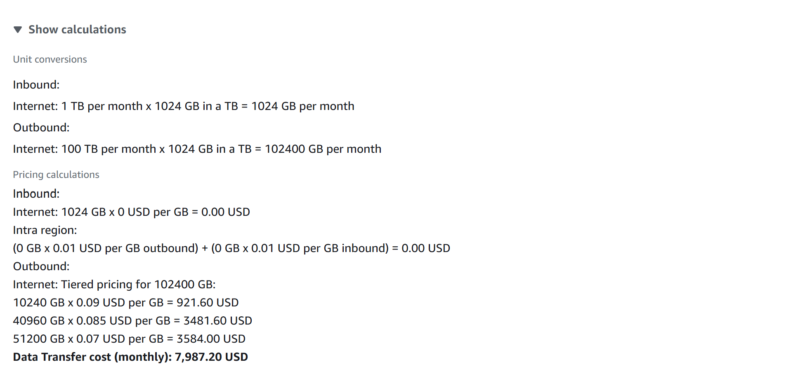

# Project04 Cloud Economics

## 📌 Project Overview
This project demonstrates how to use the AWS Pricing Calculator to estimate the cost of running a cloud-based solution.  
The estimation includes EC2 instances, storage using EBS, and data transfer.

## 🚀 Key Features & Services
- **AWS Pricing Calculator** – Estimating monthly cloud costs  
- **Amazon EC2** – Used in the estimate as a web server hosting option 
- **EBS Storage** for persistent storage.
- **Data Transfer** cost calculations.

## 🖥️ Application in Action

## 📊 Lessons Learned
- How to calculate detailed workload and costs.
- Understanding pricing components like EC2, EBS, and data transfer.
