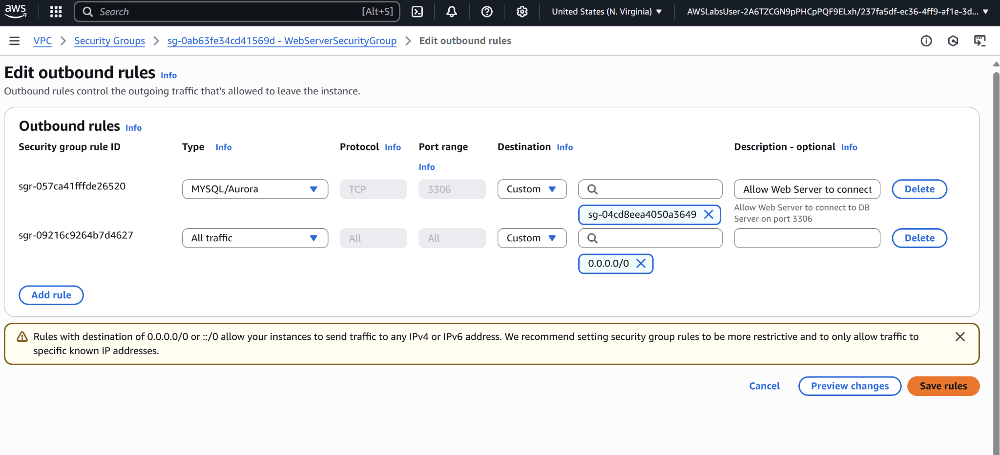
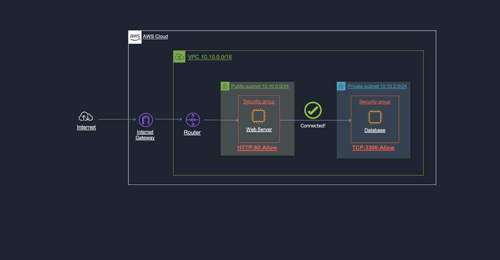

# Project05 Networking Concepts

## 📌 Project Overview
This project demonstrates configuring security groups and outbound rules.

## 🚀 Key Features & Services
- **Amazon VPC** for networking.
- **Security Groups** for traffic control.

## 🖥️ Application in Action

## 📊 Lessons Learned
- Importance of restricting traffic to known IP addresses.
