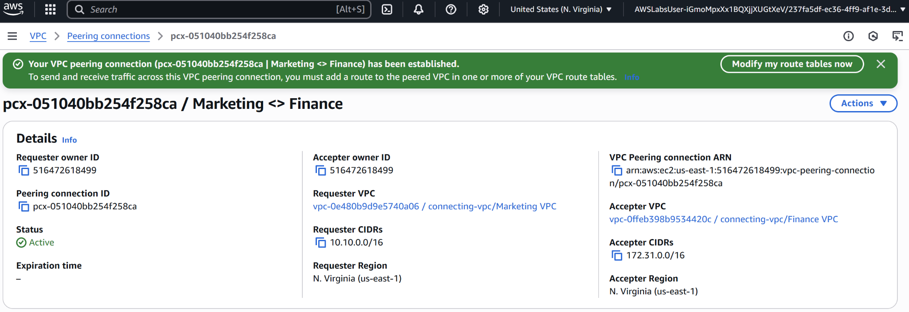
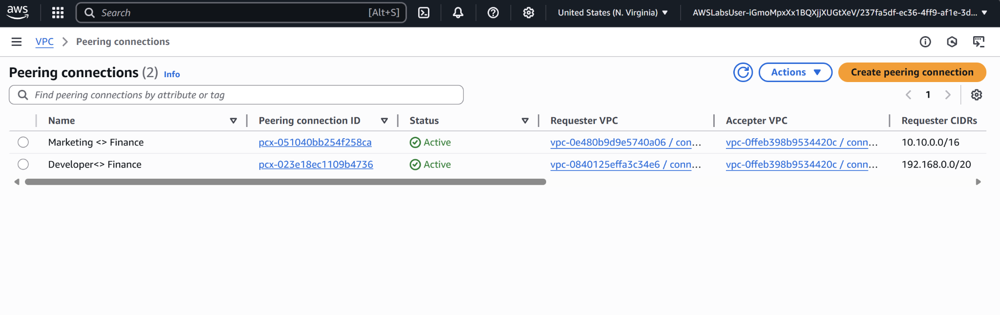

# Project06 Connecting VPCs

## 📌 Project Overview
In this project, I worked on connecting different departments in the organization by enabling communication between their VPCs. This helped the teams access shared data more easily and improved productivity.

## 🚀 Key Features & Services
- **Amazon VPC Peering** to connect isolated networks between departments.
- **Route Tables** to enable routing between peered VPCs.
- **EC2 Instances** to host workloads across departments.
- **EC2 Instance Connect** to verify connectivity between VPCs.

## 🖥️ Application in Action

## 📊 Lessons Learned
