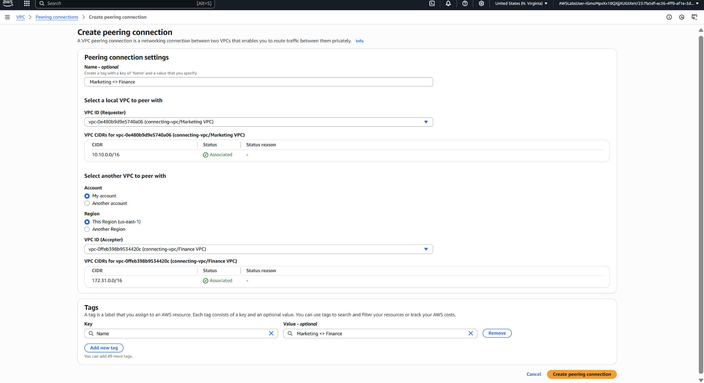

# Project06 Connecting VPCs

## 📌 Project Overview
This project focuses on enabling seamless communication between departments by connecting isolated VPCs. Each department (Marketing, Development, Finance) was placed in its own VPC for logical separation. However, to streamline access to shared resources—especially Finance reports—VPC peering was used to bridge the communication gap between these networks.

## 🚀 Key Features & Services
- **VPC Peering** for interconnecting networks.

## 🖥️ Application in Action

## 📊 Lessons Learned
- Steps for creating and verifying VPC peering connections.
