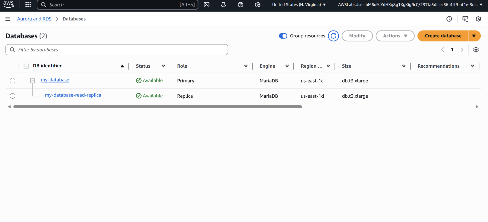

# Project07 Databases in Practice

## 📌 Project Overview
In this project, I helped a fictional insurance company modernize their database infrastructure by using **Amazon RDS**—a managed relational database service on AWS.
The goal was to reduce operational overhead for database admins, improve high availability in case of disasters, and enhance performance for read-intensive workloads by using **read replicas**.

## 🚀 Key Features & Services
- **Amazon RDS** for managed relational databases.

## 🖥️ Application in Action

## 📊 Lessons Learned
- How to set up primary and replica databases.
