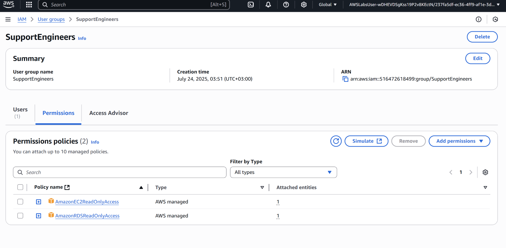

# Project08 Core Security Concepts

## 📌 Project Overview
This project demonstrates how to create IAM user groups with permission boundaries.

## 🚀 Key Features & Services
- **IAM User Groups**
- **ReadOnly Policies** for EC2 and RDS

## 🖥️ Application in Action

## 📊 Lessons Learned
- Importance of assigning least-privilege access through managed policies.
