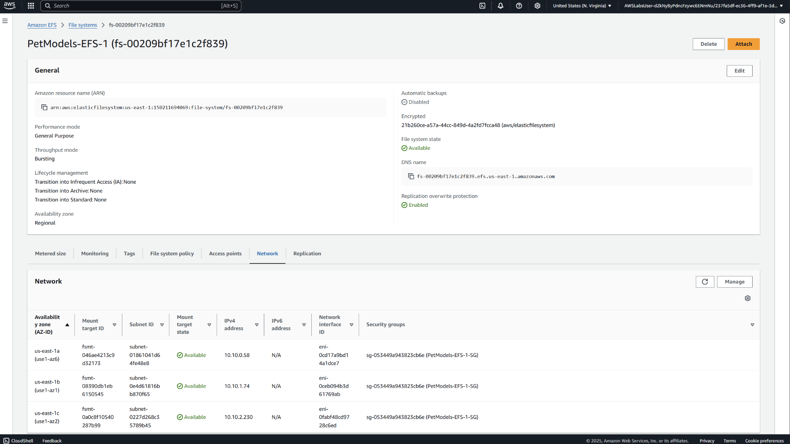

# Project09 File Systems In The Cloud

## 📌 Project Overview
In this project, I helped a growing pet service company centralize their media storage by setting up a scalable and shared file system using **Amazon Elastic File System (EFS)**. The goal was to enable consistent access to pet client photos from multiple branches, eliminate storage limitations, and establish access control across teams using security groups.

## 🚀 Key Features & Services
- **Amazon EFS** to provide scalable, shared file storage across branches.  
- **Mount Targets** to connect EC2 instances in different Availability Zones.  
- **Multi-AZ Redundancy** for high availability and data durability.  
- **Security Groups** to restrict access to EFS mounts from specific instances only.

## 🖥️ Application in Action

## 📊  Lessons Learned
- Amazon EFS simplifies data sharing between EC2 instances across multiple AZs.  
- Setting up Mount Targets in different subnets ensures high availability.  
- Security Groups are crucial for tightly controlling file system access from specific instances.  
- File mounting with NFS over TLS enhances secure data transmission.
