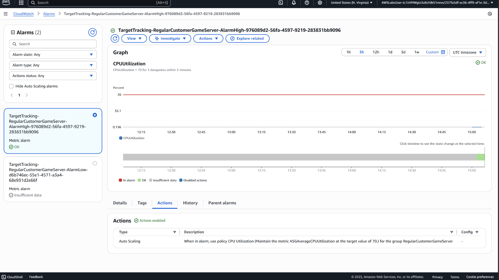

# Project10 Auto Healing And Scaling

## 📌 Project Overview
In this project, I helped a gaming café automate the provisioning and recovery of their EC2-based game servers using **Amazon EC2 Auto Scaling**—a service that automatically adjusts capacity to maintain steady performance and minimize cost. The goal was to replace crashed instances automatically, enforce daily instance limits, and prepare servers ahead of peak gaming events through scheduled scaling.

## 🚀 Key Features & Services
- **Amazon EC2 Auto Scaling Group**: Automatically adjusts the number of EC2 instances based on demand.
- **Launch Templates**: Predefined configuration for user game servers.
- **Target Tracking Scaling Policy**: Scales in/out based on average CPU utilization.
- **Scheduled Scaling**: Automatically launches and terminates instances for weekly gaming events.
- **CloudWatch Alarms**: Monitor CPU utilization and trigger scaling actions.

## 🖥️ Application in Action

## 📊 Lessons Learned
 - Auto Scaling ensures **application resilience** by automatically replacing failed EC2 instances.
- Using **scheduled scaling** helps optimize costs by provisioning servers only when needed.
- **Launch templates** simplify the management of uniform server configurations.
- Integrating **CloudWatch alarms** with Auto Scaling improves responsiveness to real-time demand.
