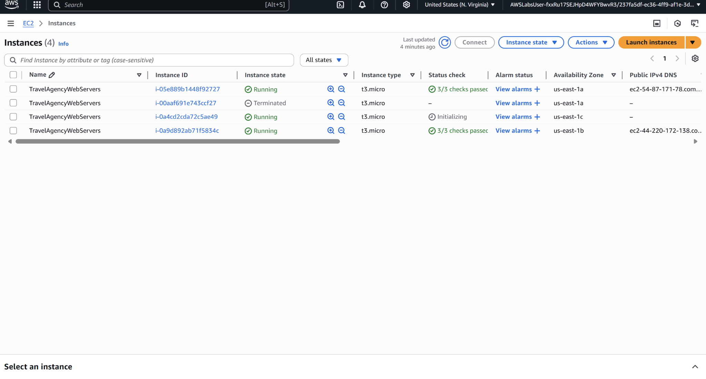
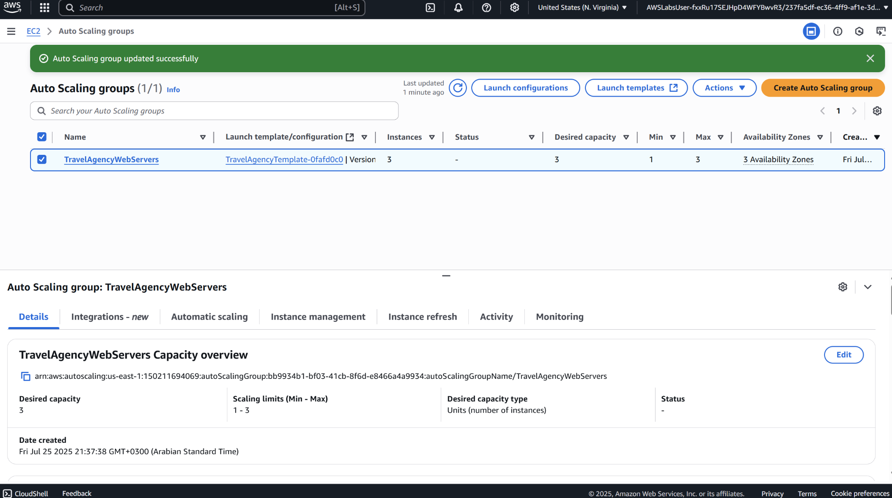

# Project11 Highly Available Web Applications

## 📌 Project Overview
In this project, I helped a fictional travel agency improve the reliability and resilience of their web application by designing a **highly available architecture** on AWS. The goal was to avoid service disruptions caused by overloaded servers or single-zone outages, especially during marketing events that drive traffic spikes.

## 🚀 Key Features & Services
- **Auto Scaling Group** spanning multiple Availability Zones to maintain instance availability during AZ failures.
- **Load Balancer (ALB)** to distribute incoming traffic evenly across EC2 instances.
- **Health Checks** to monitor EC2 instance health and ensure only healthy instances receive traffic.

##  🖥️ Application in Action

## 📊 Lessons Learned
- Deploying across multiple Availability Zones ensured better fault tolerance and minimized downtime risks.
- Attaching a load balancer enhanced the responsiveness of the app by efficiently distributing traffic.
- Health checks helped detect and replace unhealthy instances automatically, maintaining service continuity.
- Auto Scaling allowed the infrastructure to adapt to changing traffic demands without manual intervention.
