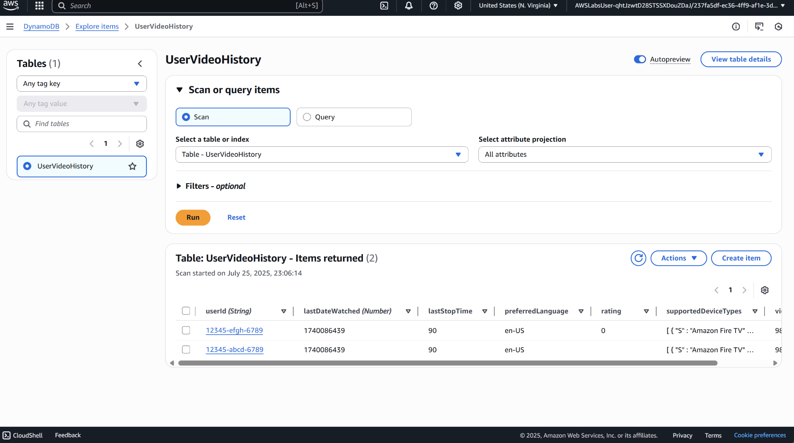

# Project12 First No SQL Database

## 📌 Project Overview
This project involves working with NoSQL databases using Amazon DynamoDB.

## 🚀 Key Features & Services
- **Amazon DynamoDB** for scalable NoSQL storage

## 🖥️ Application in Action

## 📊 Lessons Learned
- How to perform read operations and understand table structure.
